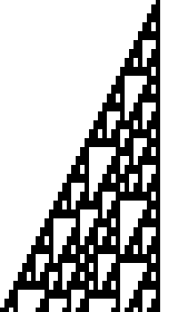

# GenerationY

An automaton drawer built in Haskell.

GenerationY is a rewrite of one of my old projects,
[GenerationX](https://github.com/mattneary/GenerationX), from JavaScript to
Haskell. The focus of this project is on following best practices in
constructing a moderately-sized Haskell project. If it can be a neat tool at
the same time, that will be a bonus.

